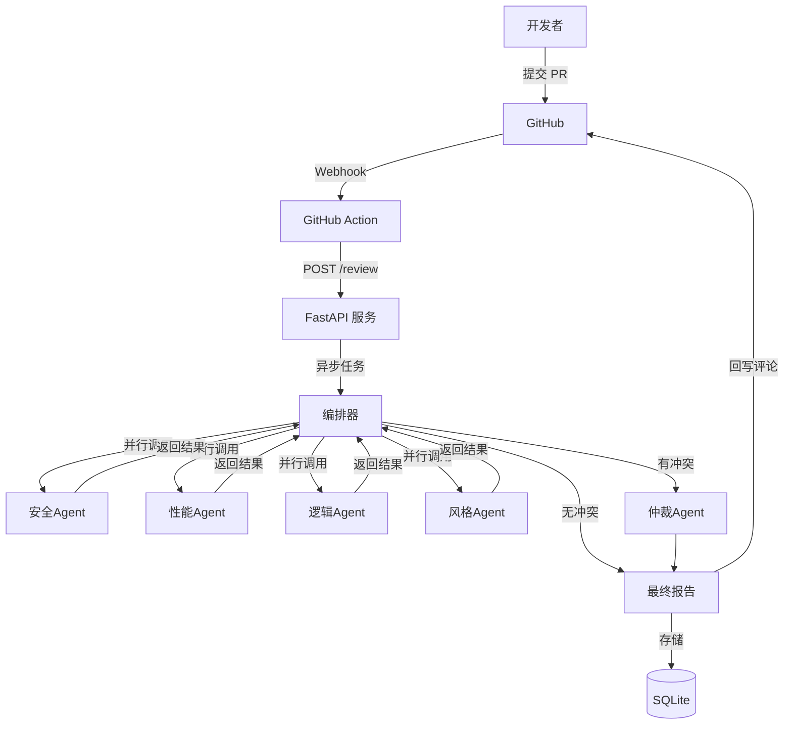

# AI PR Reviewer — 多Agent协作代码评审系统

一个由大语言模型驱动的、具备“协作-仲裁”机制的智能代码评审工具。
它模拟真实团队的评审过程，让**安全、性能、逻辑、风格**四位专家并行分析代码变更，
在出现分歧时引入**仲裁 Agent** 统一意见，最终通过 CI/CD 无缝融入开发流程。

---

## 🌟 核心亮点

- **🧠 多Agent协作与仲裁** — 四位专家并行分析，严重分歧自动触发仲裁，降低误报
- **📊 四维结构化报告** — 安全/性能/逻辑/风格独立评审，输出结构化风险列表与改进建议
- **🎯 智能上下文引擎** — 基于 tree-sitter 精准提取变更函数及调用关系，降低 Token 成本
- **✅ 修复验证闭环** — 对比同一 PR 多次提交，标记已修复、新引入、遗留问题
- **⚙️ CI/CD 无缝集成** — 提供 GitHub Action，PR 更新时自动触发，报告回写 PR 评论
- **🌐 多平台支持** — 支持 GitHub / GitLab 双平台 API 适配

---

## 🏗 系统架构



---

## 🛠 技术栈

| 层级 | 技术 | 说明 |
|------|------|------|
| 后端框架 | Python 3.11 + FastAPI | 异步 Web 服务 |
| LLM 调用 | openai Python SDK | 兼容阿里云百炼 / DeepSeek |
| 代码解析 | tree-sitter | 支持 Python / JS / TS / Go / Java / C++ |
| GitHub API | PyGithub | PR diff 拉取、评论回写 |
| 数据存储 | SQLite + aiosqlite | 评审结果持久化 |
| 数据校验 | Pydantic v2 | 请求/响应模型 |
| 前端 | Vue3 + Vite | 单页应用 |
| 部署 | Docker + Docker Compose | 多阶段构建 |

---

## 🚀 快速开始

### 前置要求

- Python 3.11+
- Node.js 18+（前端开发）
- GitHub Personal Access Token（需要 repo 权限）
- 阿里云百炼或 DeepSeek API Key

### 一键环境配置

```bash
git clone git@github.com:Solor-Drake/helios_aipr_review.git
cd helios_aipr_review
bash setup.sh
```

`setup.sh` 自动完成：Python 版本检查 → 虚拟环境创建 → 依赖安装 → .env 配置引导 → 依赖验证。

### 启动开发服务

```bash
# 后端（终端1）
source venv/bin/activate
uvicorn server.app.main:app --reload --port 8000

# 前端（终端2）
cd web
npm install
npm run dev
```

后端运行后访问 http://localhost:8000/docs 查看 Swagger API 文档。

### 运行测试

```bash
source venv/bin/activate
# 如果系统装有 ROS，需清空 PYTHONPATH 避免 Python 3.10 插件冲突
PYTHONPATH="" python -m pytest server/tests/ -v
```

### Docker 部署

```bash
docker compose up -d
```

---

## 🤝 协作规范

### 分支命名

```
feature/<功能描述>    新功能开发
fix/<问题描述>        Bug 修复
refactor/<模块名>     重构
docs/<内容>           文档更新
```

### Commit 信息

遵循 [Conventional Commits](https://www.conventionalcommits.org/)：

```
feat: 添加安全 Agent SQL 注入检测
fix: 修复历史记录对比时区问题
refactor: 提取 LLM 调用公共逻辑到 base_agent
chore: 更新 .gitignore
```

### Pull Request 流程

1. 从 `main` 切出功能分支：`git checkout -b feature/xxx`
2. 开发完成后推送：`git push origin feature/xxx`
3. 在 GitHub 创建 PR，描述变更内容和测试方式
4. 至少一人 Review 通过后才能合并
5. 合并使用 Squash merge，保持 main 历史线性
6. 合并前确保与 main 无冲突：`git rebase main`

### 代码风格

- Python：PEP 8，使用 type hints
- Vue：Composition API + `<script setup>`
- 注释使用中文
- LLM 调用的 System Prompt 存放在 `server/prompts/`，禁止硬编码在代码中

### 目录约定

| 目录 | 用途 |
|------|------|
| `server/app/` | FastAPI 应用代码 |
| `server/app/agents/` | 各 Agent 实现类 |
| `server/prompts/` | Agent System Prompt 模板 |
| `server/data/` | SQLite 数据库文件 |
| `server/tests/` | 后端测试 |
| `pyproject.toml` | pytest 配置 |
| `web/src/components/` | Vue 组件 |
| `web/src/api/` | 前端 API 调用封装 |
| `docs/` | 设计文档 |
| `.github/workflows/` | CI/CD 配置 |